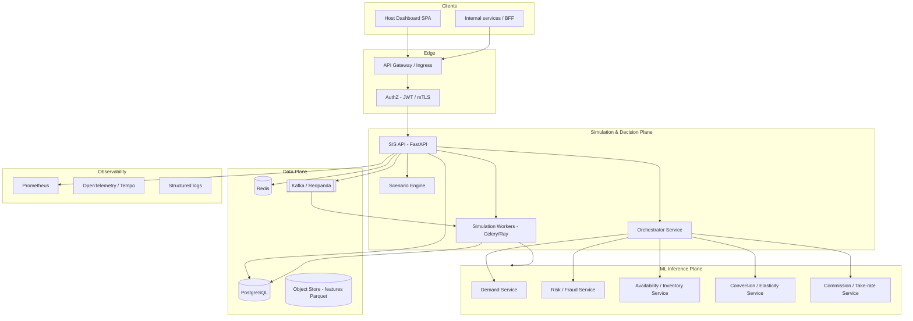

# Simulation Intelligence Platform — Staff / CTO System Design (v2)

**Audience:** Engineering leadership, platform, ML, frontend, SRE.  
**Scope:** Evolution of the existing FastAPI **Simulation Intelligence Service (SIS)** into a **production-grade, ML-integrated, horizontally scalable decision intelligence platform** comparable in *capabilities* (not clone) to large-marketplace pricing intelligence.

**Principles:** explicit contracts, graceful degradation, auditability, cost-aware latency, event-driven freshness, and separation of **online inference** vs **offline/batch** simulation.

---

## 1. Architecture Overview

### 1.1 Target logical architecture



**North-star split:**

| Plane | Responsibility | Latency budget |
|-------|----------------|----------------|
| **Online path** | Single listing, short horizon, interactive UI | p99 &lt; 300–800 ms (cached) / &lt; 2–5 s (cold + ML) |
| **Batch path** | Portfolio precompute, scenario grids, “compare strategies” | seconds–minutes; async job + poll/WebSocket |
| **ML plane** | Stateless inference with SLAs; versioned models | p99 per model &lt; 50–150 ms typical |
| **Data plane** | Runs, scenarios, outcomes, audit, features | durable, replicated |

### 1.2 Service boundaries (microservices)

1. **sis-api** (existing FastAPI app evolved): authentication boundary, request validation, sync/async orchestration, **does not** run heavy nested loops for large jobs inline.
2. **sis-orchestrator** (library inside process first; optional separate service when team size grows): EV / multi-objective scoring, strategy plugins.
3. **sis-scenario-engine**: expands scenario definitions → concrete simulation matrices; deduplication keys for cache.
4. **sis-worker** (Celery workers or Kubernetes Jobs): executes `SimulationJob` payloads; optional **Ray** for massive embarrassingly parallel sweeps.
5. **ml-*-service** (or unified **ml-gateway**): one HTTP/gRPC surface per domain with **versioned** `/v1/predict` contracts (below).

**Why not one monolith forever?** Team scaling, independent deploy for ML, blast-radius isolation, and different autoscaling (GPU vs CPU).

---

## 2. System Components

| Component | Technology | Role |
|-----------|------------|------|
| API | FastAPI + Uvicorn / Gunicorn | REST + future gRPC sidecar optional |
| Async jobs | **Celery** + Redis **or** **Kafka** consumers | Background simulations, precompute, event reactions |
| Broker | Redis (Celery) **and/or** Kafka | Kafka for cross-service events; Redis for task queue + cache |
| DB | **PostgreSQL 15+** | Runs, scenarios, audit, feedback metrics |
| Cache | Redis Cluster | Result cache + rate limit + Celery broker (split logical DB index) |
| ML serving | **KServe / TorchServe / Triton** or internal FastAPI microservices | Model hosting |
| Feature store | **Feast** (offline/online) or lightweight Postgres + materialized views v1 | Low-latency features |
| Observability | OpenTelemetry, Prometheus, Grafana, Loki/ELK | SLOs, tracing simulation spans |
| Frontend | React + TanStack Query + WebSocket/SSE | Host dashboard |

---

## 3. Improved Simulation Engine (design + pseudo-code)

### 3.1 Core abstraction: `SignalProvider` (replaces raw synthetic calls)

```python
# contracts/signals.py
from typing import Protocol, TypedDict
from datetime import datetime


class SignalBundle(TypedDict, total=False):
    demand_score: float      # 0..1
    risk_score: float        # 0..1
    availability: float      # 0..1
    conversion_prior: float  # optional prior before price conditioning
    latency_ms: float
    model_versions: dict[str, str]
    fallback_used: bool


class SignalProvider(Protocol):
    async def predict_window(
        self,
        *,
        listing_id: str,
        times: list[datetime],
        context: dict,
    ) -> list[SignalBundle]:
        ...
```

**Implementations:**

1. **`HttpMlSignalProvider`** — parallel `httpx` calls to `demand-service`, `risk-service`, etc., with **circuit breaker** + **bulk endpoint** `POST /v1/predict/batch` when available.
2. **`SyntheticSignalProvider`** — current deterministic functions (fallback).
3. **`CachedSignalProvider`** — wraps another provider with Redis key `sig:{listing_id}:{date}:{model_set_hash}`.

### 3.2 Engine refactor: vectorized inner loop (pseudo-code)

Replace Python triple nested loops for large batches with:

- **Fixed grid**: NumPy/JAX optional for “all prices × all timesteps” when formulas are algebraic.
- **Irregular scenarios**: still loop but **parallelize across scenarios** via `asyncio.gather` or worker tasks.

```python
async def run_simulation_v2(job: SimulationJob, signals: SignalProvider, orch: Orchestrator) -> SimulationResult:
    times = expand_time_grid(job.time_range, job.granularity)
    raw = await signals.predict_window(listing_id=job.listing_id, times=times, context=job.feature_context)

    # scenario tensor: list of ScenarioSpec (price path + shifts + constraints)
    results_per_scenario = []
    for scenario in job.scenarios:  # parallelize this collection in worker
        tensor = build_price_and_adjustments(times, scenario)
        rows = []
        for t, sig, price in zip(times, raw, tensor.prices):
            conv = conversion_model.predict(price=price, demand=sig["demand_score"], risk=sig["risk_score"])
            bookings = effective_bookings(sig, conv, scenario.constraints)
            revenue = split_revenue(bookings, price, job.commission_policy)
            decision = orch.score(state={...})
            rows.append(TimelineRow(...))
        results_per_scenario.append(ScenarioResult(id=scenario.id, timeline=rows, aggregates=...))

    return SimulationResult(scenarios=results_per_scenario, meta=fingerprint(job))
```

### 3.3 Performance tactics

| Pattern | When |
|---------|------|
| **Batch ML inference** | Always if `len(times) > 48` |
| **Chunked times** | Max 2k points per job; paginate |
| **Scenario parallelism** | `min(32, n_scenarios)` async tasks per worker |
| **Memoization** | Hash `(listing_id, scenario_hash, time_range_hash, model_versions)` |

---

## 4. Scenario Engine Design

### 4.1 Scenario model

```python
from pydantic import BaseModel, Field
from typing import Literal

class PricePathSpec(BaseModel):
    mode: Literal["fixed", "relative_to_base", "curve"]
    values: list[float] | None = None
    delta_pct: float | None = None  # e.g. +10%

class ConstraintSpec(BaseModel):
    min_price: float | None = None
    max_price: float | None = None
    max_risk_exposure: float | None = None  # cap bookings in high risk

class ScenarioSpec(BaseModel):
    id: str
    label: str
    demand_shift_pct: float = 0.0
    risk_shift_pct: float = 0.0
    availability_shift_pct: float = 0.0
    price: PricePathSpec
    constraints: ConstraintSpec = Field(default_factory=ConstraintSpec)
```

### 4.2 Multi-scenario API

- **`POST /v2/simulation/scenarios`** — body: `listing_id`, `time_range`, `scenarios: ScenarioSpec[]` (max N), `execution_mode: sync|async`.
- Response sync: `results: { scenario_id: SimulationResult }`.
- Response async: `{ job_id }` → **`GET /v2/jobs/{id}`** + **`GET /v2/jobs/{id}/stream`** (SSE).

### 4.3 Batch comparison

Persist **`scenario_sets`** table; UI loads **`comparison_view`** JSON:

```json
{
  "metrics": ["expected_host_net", "p95_risk", "booking_count"],
  "winner_scenario_id": "s3",
  "tradeoffs": [{ "axis": "revenue", "best": "s3" }, { "axis": "risk", "best": "s1" }]
}
```

---

## 5. Orchestrator Upgrade

### 5.1 From rules to constrained multi-objective scoring

**Objectives** (weights configurable per tenant/host tier):

- **Revenue EV** — primary
- **Risk penalty** — λ_r × risk_score
- **Fairness / parity** — deviation from platform suggested band
- **Liquidity** — underbooking penalty

```python
class ObjectiveWeights(BaseModel):
    w_revenue: float = 1.0
    w_risk: float = 0.35
    w_fairness: float = 0.15
    w_liquidity: float = 0.1


def score_timestep(*, revenue_net: float, risk: float, fairness_gap: float, liquidity_gap: float, w: ObjectiveWeights) -> float:
    return (
        w.w_revenue * revenue_net
        - w.w_risk * risk
        - w.w_fairness * abs(fairness_gap)
        - w.w_liquidity * liquidity_gap
    )
```

### 5.2 Pluggable strategies

```python
class DecisionStrategy(Protocol):
    def choose(self, candidates: list[CandidateAction]) -> CandidateAction: ...

class MaxEVStrategy: ...
class ConservativeRiskStrategy: ...
class ThompsonSamplingStrategy: ...  # exploration for price experiments
```

**Orchestrator output** must include **explainability**:

```json
{
  "decision": "PROMOTE",
  "score": 0.812,
  "components": {
    "revenue_term": 0.62,
    "risk_term": -0.11,
    "fairness_term": -0.04
  },
  "strategy": "multi_objective_v1",
  "policy_version": "2026.05.0"
}
```

---

## 6. ML Integration Layer

### 6.1 Service contracts (REST)

**Batch-first** to cut RTT:

`POST /v1/models/demand/predict`

```json
{
  "listing_id": "L123",
  "timestamps": ["2026-05-01T00:00:00Z", "..."],
  "feature_ref": "feast://listing/L123@2026-05-01"
}
```

```json
{
  "scores": [0.71, 0.68],
  "version": "demand-xgb-2026.04.2",
  "latency_ms": 12
}
```

**Fallback policy (ordered):**

1. Primary model version.
2. **Shadow** model (cheaper).
3. **Heuristic** (current deterministic).
4. **Cache last-good** per listing (Redis, 15 min).

### 6.2 Feature pipeline

- **Online:** Feast → Redis; keys `listing_id + time_bucket`.
- **Offline:** Daily Airflow/Dagster job → warehouse → training.

### 6.3 Feedback loop (real)

Tables: `prediction_log`, `outcome_event` (booking, cancel, chargeback).

**Metrics:**

- calibration error (Brier), MAPE on demand, risk precision@k.

**Retraining trigger:**

- if `rolling_7d_error > threshold` → event `model.degraded` → Kafka → training pipeline (not in hot path).

---

## 7. Scalability & Performance

| Layer | Mechanism |
|-------|-----------|
| API | Stateless replicas + Redis cache |
| Workers | Celery autoscale on queue depth |
| ML | Horizontal pods + GPU pool optional |
| DB | Read replicas for analytics queries |
| Hot listings | Dedicated **precompute** job every 15–60 min |

**Cost vs latency:**

- **Interactive:** restrict `|times| ≤ 168`, `|scenarios| ≤ 8`, enforce sync SLA.
- **Deep:** async job, email/push when ready.

---

## 8. Database Design (PostgreSQL)

### 8.1 Core tables (DDL sketch)

```sql
CREATE TABLE simulation_run (
  id            UUID PRIMARY KEY DEFAULT gen_random_uuid(),
  tenant_id     TEXT NOT NULL,
  listing_id    TEXT NOT NULL,
  request_hash  TEXT NOT NULL,
  status        TEXT NOT NULL CHECK (status IN ('queued','running','succeeded','failed')),
  created_at    TIMESTAMPTZ NOT NULL DEFAULT now(),
  finished_at   TIMESTAMPTZ,
  sync          BOOLEAN NOT NULL DEFAULT true,
  payload       JSONB NOT NULL,
  result        JSONB,
  error         TEXT
);
CREATE INDEX ON simulation_run (listing_id, created_at DESC);
CREATE INDEX ON simulation_run (tenant_id, status);

CREATE TABLE scenario_set (
  id            UUID PRIMARY KEY DEFAULT gen_random_uuid(),
  run_id        UUID NOT NULL REFERENCES simulation_run(id) ON DELETE CASCADE,
  scenarios     JSONB NOT NULL
);

CREATE TABLE decision_audit (
  id            BIGSERIAL PRIMARY KEY,
  run_id        UUID REFERENCES simulation_run(id),
  timestep      TIMESTAMPTZ NOT NULL,
  decision      TEXT NOT NULL,
  score         DOUBLE PRECISION,
  explain_json  JSONB NOT NULL,
  policy_version TEXT NOT NULL
);

CREATE TABLE prediction_feedback (
  id            BIGSERIAL PRIMARY KEY,
  listing_id    TEXT NOT NULL,
  kind          TEXT NOT NULL,
  predicted     JSONB NOT NULL,
  actual        JSONB,
  observed_at   TIMESTAMPTZ,
  error_metrics JSONB
);
```

### 8.2 Retention

- Raw runs: 90 days hot, archive to object storage.
- Audit: 1–7 years (regulatory posture dependent).

---

## 9. API Design

### 9.1 Versioned surface

- **`/v1/...`** — current stable (backward compatible).
- **`/v2/...`** — scenarios + jobs + comparison.

### 9.2 Endpoints

| Method | Path | Purpose |
|--------|------|---------|
| POST | `/v2/simulation/runs` | Create run (`sync` or `async`) |
| GET | `/v2/simulation/runs/{id}` | Poll status + result |
| GET | `/v2/simulation/runs` | List by listing (paginated) |
| POST | `/v2/simulation/precompute` | Register recurring job |
| POST | `/v1/events/recompute` | Kafka-compatible ingest from pricing service |
| GET | `/v1/listings/{id}/insights` | Aggregates from DB |

**Async pattern:**

```json
POST /v2/simulation/runs
{ "mode": "async", "listing_id": "L1", "time_range": [...], "scenarios": [...] }
→ 202 { "run_id": "uuid", "poll_url": "..." }
```

---

## 10. Frontend Design (Host Dashboard)

### 10.1 Page structure

1. **Overview** — KPI cards: optimal price, expected net, risk windows count.
2. **Simulation lab** — scenario builder (chips + sliders), **compare** table.
3. **Timeline chart** — layers: demand, bookings, price line, host net, risk band (shaded).
4. **Price–revenue curve** — peak marker + current + suggested.
5. **Explain drawer** — orch breakdown (`components` JSON).

### 10.2 Tech

- React + **Recharts** or **Visx**; WebSocket for job progress.
- Feature flags for **Experiments** (A/B on UI density).

---

## 11. DevOps & Deployment

### 11.1 Kubernetes ( sketch )

- **Deployments:** `sis-api`, `sis-worker`, `redis`, `kafka` (managed), `postgres` (RDS/GCP Cloud SQL).
- **HPA:** CPU + custom metric `celery_queue_depth` / `http_request_duration_p99`.
- **PodDisruptionBudget** on API.

### 11.2 Observability

- **RED** metrics per endpoint; **USE** for workers.
- Tracing: span `simulation.run`, child spans `ml.demand.batch`, `orch.score`.

### 11.3 CI/CD

- Lint + typecheck + **`pytest`** + contract tests against **WireMock** ML stubs.
- Canary deploy API; workers lag by one version max with compatible job schema.

---

## Migration roadmap (pragmatic)

| Phase | Deliverable |
|-------|-------------|
| **P0** | `SignalProvider` + HTTP stubs + Postgres `simulation_run` + async Celery job path |
| **P1** | Batch ML endpoints + scenario engine v2 + orchestrator explain JSON |
| **P2** | Kafka events + precompute + frontend comparison |
| **P3** | Full Feast + feedback tables + retraining automation |

---

## Summary

This design **preserves** your working FastAPI core while **forcing** clear seams: **signals**, **scenarios**, **orchestration**, **persistence**, and **async scale-out**. It matches how large marketplaces separate **online inference**, **simulation**, and **policy**—and gives you a realistic path from deterministic MVP to **millions of listings** through batching, queues, and caching—not bigger loops on one machine.

*Document version: 2026-05-04*
