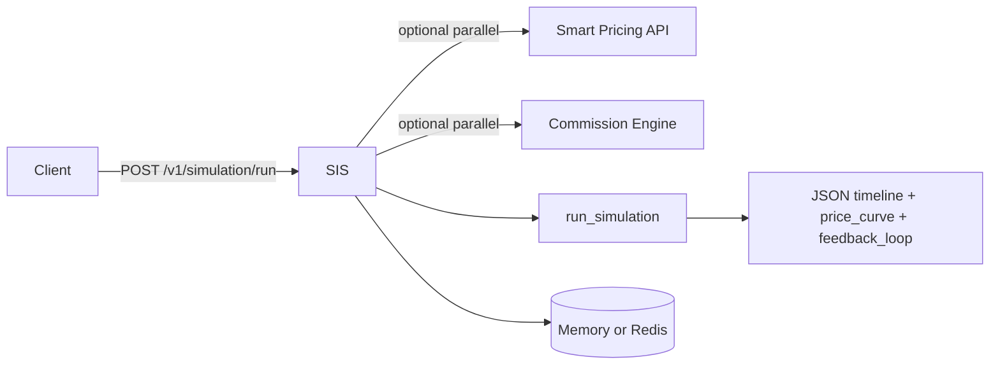

# Simulation Intelligence Service — Complete Code & Reference

This document is the **authoritative walkthrough** of the `simulation-intelligence-service` package: what it does, how it is structured, how to run and configure it, the **HTTP API**, and the **full source** of every non-trivial file with short explanations.

**Location in repo:** `simulation-intelligence-service/`

---

## Table of contents

1. [Purpose and data flow](#1-purpose-and-data-flow)
2. [Directory layout](#2-directory-layout)
3. [API reference](#3-api-reference)
4. [Response shape (JSON)](#4-response-shape-json)
5. [Configuration (environment)](#5-configuration-environment)
6. [Dependencies](#6-dependencies)
7. [Source code with explanations](#7-source-code-with-explanations)
8. [Host UI (static)](#8-host-ui-static)
9. [Tests](#9-tests)
10. [Docker](#10-docker)
11. [Running locally](#11-running-locally)

---

## 1. Purpose and data flow

**Simulation Intelligence Service (SIS)** is a **stateless FastAPI** microservice that implements a **unified “what-if” simulation** over time:

- **Demand**, **risk**, **availability**, **sync interval** (staleness steps), **conversion**, **revenue** (gross and host net after commission), and an **orchestrator-style decision** per timestep.
- A **price sweep** (`price_scenarios`) yields both a **timeline** (best price per timestep among scenarios) and a **price vs total window revenue** curve.
- Optionally calls **upstream** services in **parallel**: Smart Pricing lodging (`GET /api/pricing/{id}`) and Smart Commission Engine (`GET /pricing/{id}`) to ground **listing bounds** and **commission markup hints**.
- **Cache**: in-memory or **Redis** using keys `simulation:{listing_id}:{YYYY-MM-DD}:{hash}`.
- **Production**: rate limiting (slowapi), Prometheus **metrics**, **request IDs**, **readiness** probe when Redis is required.

High-level flow:



---

## 2. Directory layout

```
simulation-intelligence-service/
├── app/
│   ├── main.py                 # FastAPI app, routes, cache wiring
│   ├── config.py               # Pydantic settings (SIS_* env)
│   ├── cache_store.py          # Key builder, Memory + Redis cache
│   ├── engine/
│   │   ├── core.py             # run_simulation, ListingContext
│   │   ├── signals.py          # demand, risk, availability, sync, conversion
│   │   └── decision.py         # risk zones, orchestrator actions
│   ├── adapters/
│   │   └── upstream.py         # httpx async upstream fetches + asyncio.gather
│   ├── middleware/
│   │   └── request_context.py  # X-Request-Id
│   └── observability/
│       └── metrics.py          # Prometheus counters/histograms
├── public/                     # Static host demo UI
│   ├── index.html
│   ├── app.js
│   └── styles.css
├── tests/
│   ├── conftest.py
│   ├── test_api.py
│   └── test_core.py
├── docs/
│   └── SIMULATION_INTELLIGENCE_COMPLETE_REFERENCE.md   # this file
├── requirements.txt
├── Dockerfile
├── .env.example
└── .dockerignore
```

Package `__init__.py` files under `app/` are markers only (no logic).

---

## 3. API reference

| Method | Path | Description |
|--------|------|-------------|
| `GET` | `/health` or `/v1/simulation/health` | Liveness; returns `status`, `version`, `capabilities`. |
| `GET` | `/ready` | Readiness; if `SIS_REDIS_URL` set, requires Redis **ping** or **503**. |
| `GET` | `/metrics` | Prometheus text format (404 if `SIS_METRICS_ENABLED=false`). |
| `POST` | `/v1/simulation/run` | Main simulation (rate limited per `SIS_RATE_LIMIT_PER_MINUTE`). |
| `GET` | `/` | Serves `public/index.html` if present, else JSON pointers. |
| | `/docs` | Swagger UI (FastAPI). |

**`POST /v1/simulation/run` body (JSON)**

| Field | Type | Description |
|-------|------|-------------|
| `listing_id` | string | Listing identifier. |
| `time_range` | `[start, end]` | ISO-8601 strings (UTC `Z` allowed). |
| `price_scenarios` | number[] | 1–48 positive prices to sweep. |
| `vertical` | `"lodging"` \| `"car"` | Car uses lower **slot_intensity** scaling. |
| `demand_shift_pct` | number | What-if multiplier on demand signal (−0.9 … +2.0 as offset on 1.0). |
| `risk_shift_pct` | number | Same for risk. |
| `use_upstream_listing` | bool | If true and lodging URL set, fetch listing bounds. |
| `use_upstream_commission` | bool | If true and commission URL set, fetch markup hints in parallel with lodging when applicable. |

---

## 4. Response shape (JSON)

Top-level keys include:

- **`timeline`**: per-timestep rows: `demand`, `risk`, `availability_*`, `sync_factor`, `price`, `conversion`, `expected_bookings`, `revenue_gross`, `revenue` / `revenue_host_net`, `platform_take`, `risk_zone`, `booking_locked`, `decision`, …
- **`price_curve`**: per scenario price: `revenue` (host net over window), `revenue_gross`, `conversion_mean`.
- **`price_curve_meta`**: `optimal_price`, `current_price`, `host_suggested_price`, `model_suggested_price`.
- **`best_scenario`**, **`recommendation`**, **`risk_summary`** (thresholds, zones, high-risk period strings), **`feedback_loop`**, **`layers`**, **`commission_summary`**, **`meta`**.

---

## 5. Configuration (environment)

All settings use prefix **`SIS_`**. Copy `.env.example` to `.env` at the service root.

### `.env.example` (full file)

```bash
# Server
SIS_HOST=0.0.0.0
SIS_PORT=8090
SIS_CORS_ORIGINS=*
SIS_LOG_LEVEL=INFO
SIS_SERVICE_VERSION=1.1.0

# Commission & demand scale
SIS_PLATFORM_COMMISSION_PCT=0.12
SIS_BOOKING_UNITS_PER_SLOT=24

# Doc: sync interval model (hours) — step refresh / staleness
SIS_SYNC_INTERVAL_HOURS=3

# Upstream (optional) — enable real listing + commission hints
# Smart Pricing (lodging) — same service that exposes GET /api/pricing/{id}
# SIS_UPSTREAM_LODGING_BASE_URL=http://127.0.0.1:8000
# Car API (reserved for future car-specific quotes)
# SIS_UPSTREAM_CAR_BASE_URL=
# Smart Commission Engine — root where GET /pricing/{listingId} exists
# SIS_UPSTREAM_COMMISSION_BASE_URL=http://127.0.0.1:3000

# Cache: doc pattern simulation:{listing_id}:{date}:{hash} — set Redis for multi-replica
# SIS_REDIS_URL=redis://127.0.0.1:6379/0
# 5–15 min typical; 600s default
SIS_CACHE_TTL_SECONDS=600

# Resilience
SIS_REQUEST_TIMEOUT_SECONDS=8.0
SIS_MAX_UPSTREAM_RETRIES=2

# Production
# 0 = unlimited
SIS_RATE_LIMIT_PER_MINUTE=120
SIS_METRICS_ENABLED=true
```

---

## 6. Dependencies

File: `requirements.txt`

```text
fastapi>=0.109.0
uvicorn[standard]>=0.27.0
httpx>=0.26.0
pydantic>=2.5.0
pydantic-settings>=2.1.0
redis>=5.0.0
slowapi>=0.1.9
prometheus-client>=0.19.0
pytest>=7.4.0
```

---

## 7. Source code with explanations

### 7.1 `app/config.py`

**Role:** Central typed configuration via `pydantic-settings`. Values load from environment (`SIS_*`) and optional `.env`. `get_settings()` is `@lru_cache` so it is a singleton unless the cache is cleared (tests do this).

```python
from __future__ import annotations

from functools import lru_cache

from pydantic import Field
from pydantic_settings import BaseSettings, SettingsConfigDict


class Settings(BaseSettings):
    model_config = SettingsConfigDict(env_file=".env", env_prefix="SIS_", extra="ignore")

    host: str = "0.0.0.0"
    port: int = 8090
    cors_origins: str = "*"

    platform_commission_pct: float = Field(0.12, ge=0.0, le=0.5)
    booking_units_per_slot: float = Field(24.0, ge=0.0)

    """Sync interval model (hours): step refreshes for staleness multipliers."""
    sync_interval_hours: int = Field(3, ge=1, le=168)

    upstream_lodging_base_url: str | None = None
    upstream_car_base_url: str | None = None
    upstream_commission_base_url: str | None = None

    redis_url: str | None = None
    cache_ttl_seconds: int = Field(600, ge=0, description="Doc: 5–15 minutes typical; 600s default")

    request_timeout_seconds: float = 8.0
    max_upstream_retries: int = Field(2, ge=0, le=5)

    rate_limit_per_minute: int = Field(120, ge=0)
    metrics_enabled: bool = True
    log_level: str = "INFO"
    service_version: str = "1.1.0"


@lru_cache
def get_settings() -> Settings:
    return Settings()
```

---

### 7.2 `app/cache_store.py`

**Role:** Implements the **documented cache key** `simulation:{listing_id}:{date}:{hash}`, plus **MemoryCache** (thread-locked TTL map) and **RedisCache** (JSON values, `setex`, `ping` for health).

```python
from __future__ import annotations

import hashlib
import json
import logging
import time
from datetime import datetime
from threading import Lock
from typing import Any, Protocol

log = logging.getLogger(__name__)


def build_doc_cache_key(*, listing_id: str, time_start: datetime, body_fingerprint: str) -> str:
    """
    Key pattern from requirements: simulation:{listing_id}:{date}:{hash}
    """
    day = time_start.strftime("%Y-%m-%d")
    h = hashlib.sha256(body_fingerprint.encode()).hexdigest()[:24]
    return f"simulation:{listing_id}:{day}:{h}"


class CacheStore(Protocol):
    def get(self, key: str) -> dict[str, Any] | None: ...
    def set(self, key: str, value: dict[str, Any], ttl_seconds: int) -> None: ...


class MemoryCache:
    def __init__(self) -> None:
        self._data: dict[str, tuple[float, dict[str, Any]]] = {}
        self._lock = Lock()

    def get(self, key: str) -> dict[str, Any] | None:
        now = time.time()
        with self._lock:
            hit = self._data.get(key)
            if not hit:
                return None
            exp, payload = hit
            if exp < now:
                del self._data[key]
                return None
            return dict(payload)

    def set(self, key: str, value: dict[str, Any], ttl_seconds: int) -> None:
        with self._lock:
            self._data[key] = (time.time() + ttl_seconds, dict(value))


class RedisCache:
    def __init__(self, url: str) -> None:
        import redis

        self._r = redis.Redis.from_url(url, decode_responses=True, socket_connect_timeout=2.0)

    def ping(self) -> bool:
        try:
            return bool(self._r.ping())
        except Exception:  # noqa: BLE001
            return False

    def get(self, key: str) -> dict[str, Any] | None:
        try:
            raw = self._r.get(key)
        except Exception as e:  # noqa: BLE001
            log.warning("redis get failed: %s", e)
            return None
        if not raw:
            return None
        try:
            return json.loads(raw)
        except json.JSONDecodeError:
            return None

    def set(self, key: str, value: dict[str, Any], ttl_seconds: int) -> None:
        try:
            self._r.setex(key, ttl_seconds, json.dumps(value, default=str))
        except Exception as e:  # noqa: BLE001
            log.warning("redis set failed: %s", e)


def create_cache_store(redis_url: str | None) -> CacheStore:
    if redis_url:
        try:
            return RedisCache(redis_url)
        except Exception as e:  # noqa: BLE001
            log.warning("redis unavailable (%s); using in-memory cache", e)
    return MemoryCache()
```

---

### 7.3 `app/engine/decision.py`

**Role:** Maps **risk** to UI zones (**LOCK** / **UNSTABLE** / **SAFE**) using thresholds aligned with the product doc (e.g. hard lock at **0.8**). **`decide()`** returns orchestrator actions: `BLOCK`, `DEFEND`, `PROMOTE`, `REDUCE_PRICE`, `HOLD`.

*(Full file reproduced below.)*

```python
from __future__ import annotations

from enum import Enum


# Doc thresholds: >0.8 hard lock, <0.5 allow
RISK_HARD_LOCK = 0.8
RISK_ALLOW = 0.5
RISK_UNSTABLE_BAND = 0.65


class OrchestratorAction(str, Enum):
    PROMOTE = "PROMOTE"
    HOLD = "HOLD"
    DEFEND = "DEFEND"
    REDUCE_PRICE = "REDUCE_PRICE"
    BLOCK = "BLOCK"


class RiskZone(str, Enum):
    LOCK = "LOCK"  # red — hard lock
    UNSTABLE = "UNSTABLE"  # yellow
    SAFE = "SAFE"  # green


def risk_zone(risk: float) -> str:
    if risk >= RISK_HARD_LOCK:
        return RiskZone.LOCK.value
    if risk >= RISK_UNSTABLE_BAND:
        return RiskZone.UNSTABLE.value
    if risk < RISK_ALLOW:
        return RiskZone.SAFE.value
    return RiskZone.UNSTABLE.value


def decide(
    *,
    risk: float,
    demand: float,
    revenue_net: float,
    revenue_baseline: float,
    defend_threshold: float = 0.65,
    catastrophic_threshold: float = 0.95,
) -> str:
    if risk >= catastrophic_threshold:
        return OrchestratorAction.BLOCK.value
    if risk >= RISK_HARD_LOCK:
        return OrchestratorAction.BLOCK.value
    if risk >= defend_threshold:
        return OrchestratorAction.DEFEND.value
    if demand >= 0.72 and risk < RISK_ALLOW and revenue_net >= revenue_baseline * 1.02:
        return OrchestratorAction.PROMOTE.value
    if demand < 0.38 or revenue_net < revenue_baseline * 0.92:
        return OrchestratorAction.REDUCE_PRICE.value
    return OrchestratorAction.HOLD.value
```

---

### 7.4 `app/engine/signals.py`

**Role:** Deterministic **pseudo-models** driven by `listing_seed(listing_id)` so the same inputs reproduce the same curves. Provides:

- **`iter_time_steps`**: hour / 6h / day granularity by horizon.
- **`demand_score_at`**, **`risk_score_at`**, **`availability_at`**
- **`sync_step_factor`**: two-level step by hour bucket (sync interval model).
- **`couple_risk_to_availability`**: risk reduces effective availability.
- **`conversion_probability`**: price elasticity vs anchor, demand, risk.

```python
from __future__ import annotations

import math
from datetime import datetime, timedelta, timezone
from typing import Iterator


def listing_seed(listing_id: str) -> int:
    h = 0
    for c in listing_id:
        h = (h * 31 + ord(c)) & 0xFFFFFFFF
    return h if h else 1


def iter_time_steps(
    start: datetime,
    end: datetime,
    *,
    max_points: int = 500,
) -> Iterator[datetime]:
    t = start.replace(tzinfo=timezone.utc) if start.tzinfo is None else start.astimezone(timezone.utc)
    end_utc = end.replace(tzinfo=timezone.utc) if end.tzinfo is None else end.astimezone(timezone.utc)
    if end_utc <= t:
        yield t
        return
    span = end_utc - t
    if span <= timedelta(days=7):
        step = timedelta(hours=1)
    elif span <= timedelta(days=45):
        step = timedelta(hours=6)
    else:
        step = timedelta(days=1)

    n = 0
    while t <= end_utc and n < max_points:
        yield t
        t += step
        n += 1


def demand_score_at(seed: int, t: datetime) -> float:
    """0..1 demand intensity (deterministic for a given listing + time)."""
    u = (seed % 97) / 97.0
    day = t.timetuple().tm_yday
    hour = t.hour
    # weekly + diurnal pattern
    w = 0.55 + 0.25 * math.sin((day + u * 10) / 4.0)
    d = 0.12 * math.sin((hour - 6) / 12.0 * math.pi)  # afternoon lift
    base = w + d
    return _clamp01(base)


def risk_score_at(seed: int, t: datetime) -> float:
    """0..1 risk; higher in late evening (fraud / last-minute)."""
    u = ((seed * 7) % 53) / 53.0
    hour = t.hour
    weekend = 1.0 if t.weekday() >= 5 else 0.0
    late = 1.0 if hour >= 22 or hour < 5 else 0.0
    r = 0.15 + 0.08 * weekend + 0.18 * late + 0.12 * math.sin((hour + u * 5) / 6.0)
    return _clamp01(r)


def availability_at(seed: int, t: datetime) -> float:
    """0..1 bookable inventory signal."""
    u = ((seed * 13) % 41) / 41.0
    weekend_drop = 0.08 if t.weekday() >= 5 else 0.0
    a = 0.88 - weekend_drop + 0.05 * math.sin((t.timetuple().tm_yday + u * 3) / 7.0)
    return _clamp01(a)


def sync_step_factor(seed: int, t: datetime, interval_hours: int) -> float:
    """
    Sync interval model (doc): step function over time — data freshness & conflict risk.
    Alternates between two plateaus to mimic refresh cycles.
    """
    ih = max(1, int(interval_hours))
    t_utc = t.replace(tzinfo=timezone.utc) if t.tzinfo is None else t.astimezone(timezone.utc)
    hour_block = int(t_utc.timestamp() // 3600)
    step = (hour_block // ih) % 2
    u = (seed % 7) / 7.0
    base = 0.86 + 0.12 * step
    return _clamp01(base + 0.02 * math.sin(u + float(step)))


def couple_risk_to_availability(availability: float, risk: float) -> float:
    """
    Doc interaction: risk affects availability (unsafe windows reduce bookable flow).
    """
    penalty = 0.15 + 0.55 * max(0.0, risk - 0.35) ** 1.25
    return _clamp01(availability * (1.0 - penalty))


def conversion_probability(
    price: float,
    base_anchor: float,
    demand: float,
    risk: float,
) -> float:
    """
    Elasticity-style conversion: price above anchor hurts; demand helps; risk hurts.
    """
    base = max(base_anchor, 1.0)
    rel = (price - base) / base
    penalty = max(0.0, rel) * 0.85
    discount_boost = max(0.0, -rel) * 0.35
    c = 0.22 + 0.45 * demand - 0.4 * penalty + discount_boost - 0.25 * risk
    return _clamp01(c)


def _clamp01(x: float) -> float:
    return max(0.0, min(1.0, x))
```

---

### 7.5 `app/engine/core.py`

**Role:** **`run_simulation`** is the mathematical core:

1. Builds **`ListingContext`** (from upstream or `default_listing_context`).
2. For each timestep, computes signals, then **for each price scenario** computes bookings and revenue; picks the **best host-net revenue** for that timestep.
3. Builds **`price_curve`** by fixing each price across all timesteps and summing net revenue.
4. Emits **`feedback_loop`**, **`layers`**, **`commission_summary`**, **`risk_summary`**, **`recommendation`**.

**Formulas:** `bookings ≈ demand × conversion × availability_effective × booking_units × slot_intensity`; if **risk ≥ RISK_HARD_LOCK**, bookings `× 0.04`; `gross = bookings × price`, host net and platform take use **`_effective_commission_rate`**.

```python
from __future__ import annotations

import math
from dataclasses import dataclass
from datetime import datetime
from typing import Any

from app.config import Settings
from app.engine.decision import RISK_HARD_LOCK, decide, risk_zone
from app.engine.signals import (
    availability_at,
    conversion_probability,
    couple_risk_to_availability,
    demand_score_at,
    iter_time_steps,
    listing_seed,
    risk_score_at,
    sync_step_factor,
)


@dataclass
class ListingContext:
    base_anchor: float
    min_price: float
    max_price: float
    name: str | None = None
    current_price: float | None = None
    suggested_price: float | None = None
    commission_markup: float | None = None
    commission_mode: str | None = None


def default_listing_context(listing_id: str) -> ListingContext:
    s = listing_seed(listing_id)
    base = 80.0 + (s % 70)
    return ListingContext(
        base_anchor=float(base),
        min_price=max(25.0, round(base * 0.55, 2)),
        max_price=round(base * 1.55, 2),
        current_price=float(base),
        suggested_price=round(base * 1.03, 2),
        name=None,
    )


def _effective_commission_rate(settings: Settings, listing: ListingContext | None) -> float:
    base = float(settings.platform_commission_pct)
    if listing and listing.commission_markup is not None:
        # markup from commission engine nudges platform take within guardrails
        return max(0.0, min(0.5, base + float(listing.commission_markup) * 0.15))
    return base


def _build_feedback_loop(
    timeline: list[dict[str, Any]],
    listing_id: str,
) -> dict[str, Any]:
    """Doc: prediction → actual proxy → error → retrain signal."""
    if not timeline:
        return {
            "status": "insufficient_data",
            "pipeline_hook": "prediction_feedback",
        }
    seed = listing_seed(listing_id)
    pred = sum(r["demand"] for r in timeline) / len(timeline)
    drift = 0.92 + 0.08 * math.sin(seed % 17)
    actual_proxy = _clamp01(pred * drift)
    err = pred - actual_proxy
    return {
        "status": "ok",
        "pipeline_hook": "prediction_feedback",
        "prediction_demand_mean": round(pred, 4),
        "outcome_demand_proxy": round(actual_proxy, 4),
        "error": round(err, 4),
        "model_update_recommended": abs(err) > 0.04,
        "ml_retraining_hooks": ["ranking", "conversion", "risk_calibration"],
    }


def _layer_notes() -> dict[str, str]:
    return {
        "demand_curve": "Baseline demand score from demand_forecast() / composite signal",
        "availability_filter": "availability_probability × sync_interval × risk coupling (doc loop)",
        "risk_overlay": "risk_score with LOCK/UNSTABLE/SAFE zones; >=0.8 hard lock",
        "price_line": "Chosen scenario price or optimized pick per timestep",
        "revenue_curve": "Gross and host net after commission overlay",
        "commission_overlay": "Platform take vs host net; optional commission engine markup",
        "final_decision": "Orchestrator output (EV + safety)",
    }


def run_simulation(
    *,
    listing_id: str,
    time_start: datetime,
    time_end: datetime,
    price_scenarios: list[float],
    settings: Settings,
    listing: ListingContext | None = None,
    demand_multiplier: float = 1.0,
    risk_multiplier: float = 1.0,
    slot_intensity: float = 1.0,
) -> dict[str, Any]:
    ctx = listing or default_listing_context(listing_id)
    if ctx.current_price is None:
        ctx.current_price = ctx.base_anchor
    if ctx.suggested_price is None:
        ctx.suggested_price = round(ctx.base_anchor * 1.04, 2)

    seed = listing_seed(listing_id)
    prices = sorted({round(float(p), 2) for p in price_scenarios if p > 0})
    if not prices:
        prices = [round(ctx.base_anchor, 2)]

    comm = _effective_commission_rate(settings, ctx)
    units = float(settings.booking_units_per_slot) * max(0.0, slot_intensity)
    times = list(iter_time_steps(time_start, time_end))
    sync_h = int(settings.sync_interval_hours)

    timeline: list[dict[str, Any]] = []
    baseline_revenue = max(1.0, ctx.base_anchor * 0.18 * units)

    for t in times:
        d = _clamp01(demand_score_at(seed, t) * demand_multiplier)
        r = _clamp01(risk_score_at(seed, t) * risk_multiplier)
        a_raw = availability_at(seed, t)
        sync_f = sync_step_factor(seed, t, sync_h)
        a_pre = _clamp01(a_raw * sync_f)
        a_eff = couple_risk_to_availability(a_pre, r)
        rz = risk_zone(r)
        locked = r >= RISK_HARD_LOCK

        best: dict[str, Any] | None = None
        for price in prices:
            price = max(ctx.min_price, min(ctx.max_price, price))
            conv = conversion_probability(price, ctx.base_anchor, d, r)
            bookings = d * conv * a_eff * units
            if locked:
                bookings *= 0.04
            gross = bookings * price
            net_host = gross * (1.0 - comm)
            platform_take = gross * comm
            decision = decide(
                risk=r,
                demand=d,
                revenue_net=net_host,
                revenue_baseline=baseline_revenue * (0.85 + 0.3 * d),
            )
            cand = {
                "price": price,
                "conversion": round(conv, 4),
                "expected_bookings": round(bookings, 4),
                "revenue_gross": round(gross, 2),
                "revenue": round(net_host, 2),
                "revenue_host_net": round(net_host, 2),
                "platform_take": round(gross * comm, 2),
                "decision": decision,
            }
            if best is None or cand["revenue"] > best["revenue"]:
                best = cand

        assert best is not None
        b = float(best["expected_bookings"])
        g = float(best["revenue_gross"])
        nh = float(best["revenue_host_net"])
        pt = float(best.get("platform_take") or round(g * comm, 2))

        timeline.append(
            {
                "time": t.isoformat().replace("+00:00", "Z"),
                "demand": round(d, 4),
                "risk": round(r, 4),
                "availability_raw": round(a_raw, 4),
                "sync_factor": round(sync_f, 4),
                "availability": round(a_pre, 4),
                "availability_effective": round(a_eff, 4),
                "price": best["price"],
                "conversion": best["conversion"],
                "expected_bookings": b,
                "bookings": round(b, 2),
                "revenue_gross": g,
                "revenue": nh,
                "revenue_host_net": nh,
                "platform_take": pt,
                "host_earnings": nh,
                "commission_rate_applied": comm,
                "risk_zone": rz,
                "booking_locked": locked,
                "decision": best["decision"],
            }
        )

    price_curve: list[dict[str, Any]] = []
    for price in prices:
        price = max(ctx.min_price, min(ctx.max_price, price))
        total_gross = 0.0
        total_net = 0.0
        conv_acc = 0.0
        n_s = 0
        for t in times:
            d = _clamp01(demand_score_at(seed, t) * demand_multiplier)
            r = _clamp01(risk_score_at(seed, t) * risk_multiplier)
            a_raw = availability_at(seed, t)
            sync_f = sync_step_factor(seed, t, sync_h)
            a_pre = _clamp01(a_raw * sync_f)
            a_eff = couple_risk_to_availability(a_pre, r)
            conv = conversion_probability(price, ctx.base_anchor, d, r)
            conv_acc += conv
            n_s += 1
            locked = r >= RISK_HARD_LOCK
            bookings = d * conv * a_eff * units
            if locked:
                bookings *= 0.04
            g = bookings * price
            total_gross += g
            total_net += g * (1.0 - comm)
        price_curve.append(
            {
                "price": price,
                "revenue": round(total_net, 2),
                "revenue_gross": round(total_gross, 2),
                "conversion_mean": round(conv_acc / max(1, n_s), 4),
            }
        )

    price_curve.sort(key=lambda x: x["price"])
    best_pc = max(price_curve, key=lambda x: x["revenue"])

    high_risk_periods = _risk_windows(timeline)
    recommendation = _build_recommendation(timeline, best_pc, ctx)
    feedback_loop = _build_feedback_loop(timeline, listing_id)

    optimal_price = best_pc["price"]
    rz_counts = {
        "LOCK": sum(1 for row in timeline if row["risk_zone"] == "LOCK"),
        "UNSTABLE": sum(1 for row in timeline if row["risk_zone"] == "UNSTABLE"),
        "SAFE": sum(1 for row in timeline if row["risk_zone"] == "SAFE"),
    }
    model_suggested = round(float(recommendation["best_price"]), 2)

    return {
        "listing_id": listing_id,
        "listing": {
            "base_anchor": ctx.base_anchor,
            "min_price": ctx.min_price,
            "max_price": ctx.max_price,
            "name": ctx.name,
            "current_price": ctx.current_price,
            "suggested_price": ctx.suggested_price,
        },
        "timeline": timeline,
        "price_curve": price_curve,
        "price_curve_meta": {
            "optimal_price": optimal_price,
            "current_price": ctx.current_price,
            "host_suggested_price": ctx.suggested_price,
            "model_suggested_price": model_suggested,
        },
        "best_scenario": {
            "price": best_pc["price"],
            "revenue": best_pc["revenue"],
            "revenue_gross": best_pc.get("revenue_gross"),
        },
        "recommendation": recommendation,
        "risk_summary": {
            "high_risk_periods": high_risk_periods,
            "max_risk": max((row["risk"] for row in timeline), default=0.0),
            "thresholds": {"hard_lock": RISK_HARD_LOCK, "allow": 0.5, "unstable_band": 0.65},
            "zones": rz_counts,
        },
        "feedback_loop": feedback_loop,
        "layers": _layer_notes(),
        "commission_summary": {
            "platform_commission_pct": comm,
            "source": "commission_engine" if ctx.commission_markup is not None else "config",
            "markup_hint": ctx.commission_markup,
            "mode": ctx.commission_mode,
        },
        "meta": {
            "platform_commission_pct": comm,
            "booking_units_per_slot": units,
            "sync_interval_hours": sync_h,
            "points": len(timeline),
            "model_interaction": "demand→pricing; demand→risk; risk→availability; pricing→conversion; revenue→orchestrator",
        },
    }


def _build_recommendation(
    timeline: list[dict[str, Any]],
    best_pc: dict[str, Any],
    ctx: ListingContext,
) -> dict[str, Any]:
    if not timeline:
        return {
            "action": "HOLD",
            "reason": "No timeline data",
            "confidence": 0.0,
            "best_price": ctx.base_anchor,
            "expected_window_revenue": 0.0,
        }
    avg_dem = sum(r["demand"] for r in timeline) / len(timeline)
    avg_risk = sum(r["risk"] for r in timeline) / len(timeline)
    total_rev = sum(r["revenue_host_net"] for r in timeline)

    if avg_risk > 0.75:
        action = "DEFEND"
        reason = "Elevated risk across the window — tighten booking rules and monitor fraud signals."
        conf = 0.78
    elif avg_dem > 0.65 and avg_risk < 0.45:
        action = "INCREASE_PRICE"
        reason = "Strong demand with manageable risk — move toward the optimal price on the revenue curve."
        conf = 0.84
    elif avg_dem < 0.42:
        action = "DECREASE_PRICE_OR_PROMOTE"
        reason = "Soft demand — test a lower price or increase listing quality signals."
        conf = 0.72
    else:
        action = "HOLD"
        reason = "Balanced market — keep strategy; use overlays to time price moves."
        conf = 0.66

    return {
        "action": action,
        "reason": reason,
        "confidence": round(conf, 2),
        "best_price": best_pc["price"],
        "expected_window_revenue": round(total_rev, 2),
    }


def _risk_windows(timeline: list[dict[str, Any]], threshold: float = 0.72) -> list[str]:
    if not timeline:
        return []
    windows: list[str] = []
    i = 0
    while i < len(timeline):
        if timeline[i]["risk"] < threshold:
            i += 1
            continue
        start = timeline[i]["time"]
        j = i
        while j < len(timeline) and timeline[j]["risk"] >= threshold:
            j += 1
        end = timeline[j - 1]["time"]
        windows.append(f"{_short_ts(start)}–{_short_ts(end)}")
        i = j
    return windows[:12]


def _short_ts(iso: str) -> str:
    return iso[:16].replace("T", " ") if len(iso) >= 16 else iso


def _clamp01(x: float) -> float:
    return max(0.0, min(1.0, x))
```

---

### 7.6 `app/adapters/upstream.py`

**Role:** Async HTTP to optional backends. **`fetch_parallel_listing_context`** uses **`asyncio.gather`** to run lodging + commission in parallel when both are enabled.

```python
from __future__ import annotations

import asyncio
import logging
from typing import Any

import httpx

from app.config import Settings
from app.engine.core import ListingContext

log = logging.getLogger(__name__)


async def fetch_lodging_listing_context(
    client: httpx.AsyncClient,
    settings: Settings,
    listing_id: str,
) -> ListingContext | None:
    base = settings.upstream_lodging_base_url
    if not base:
        return None
    url = base.rstrip("/") + f"/api/pricing/{listing_id}"
    try:
        r = await client.get(url, timeout=settings.request_timeout_seconds)
    except httpx.RequestError as e:
        log.debug("lodging upstream unreachable: %s", e)
        return None
    if r.status_code == 404:
        return None
    if r.status_code >= 400:
        log.debug("lodging upstream error %s: %s", r.status_code, r.text[:200])
        return None
    data: dict[str, Any] = r.json()
    listing = data.get("listing") or {}
    prefs = data.get("settings") or {}
    name = listing.get("name")
    min_p = float(prefs.get("min_price") or 0)
    max_p = float(prefs.get("max_price") or 0)
    base_price = prefs.get("base_price") or data.get("suggested_try_price")
    if base_price is None:
        base_price = (min_p + max_p) / 2 if min_p and max_p else None
    if base_price is None:
        return None
    bp = float(base_price)
    if min_p <= 0:
        min_p = max(20.0, round(bp * 0.6, 2))
    if max_p <= 0:
        max_p = round(bp * 1.5, 2)
    suggested_try = data.get("suggested_try_price")
    if suggested_try is not None:
        sp = float(suggested_try)
    else:
        sp = round((min_p + max_p) / 2, 2)
    return ListingContext(
        base_anchor=bp,
        min_price=min_p,
        max_price=max_p,
        name=str(name)[:120] if name else None,
        current_price=bp,
        suggested_price=round(sp, 2),
    )


async def fetch_commission_pricing_hint(
    client: httpx.AsyncClient,
    settings: Settings,
    listing_id: str,
) -> dict[str, Any] | None:
    base = settings.upstream_commission_base_url
    if not base:
        return None
    url = base.rstrip("/") + f"/pricing/{listing_id}"
    try:
        r = await client.get(url, timeout=settings.request_timeout_seconds)
    except httpx.RequestError as e:
        log.debug("commission upstream unreachable: %s", e)
        return None
    if r.status_code != 200:
        return None
    data: dict[str, Any] = r.json()
    return {
        "markup": data.get("markup"),
        "mode": data.get("mode"),
        "final_price": data.get("final_price"),
    }


async def fetch_parallel_listing_context(
    client: httpx.AsyncClient,
    settings: Settings,
    listing_id: str,
    *,
    include_commission: bool,
) -> tuple[ListingContext | None, dict[str, Any] | None]:
    """
    Doc: parallel execution of model/adapters (Promise.all style).
    """
    lodger = fetch_lodging_listing_context(client, settings, listing_id)
    if include_commission and settings.upstream_commission_base_url:
        commer = fetch_commission_pricing_hint(client, settings, listing_id)
        a, b = await asyncio.gather(lodger, commer, return_exceptions=True)
    else:
        a = await lodger
        b = None

    if isinstance(a, Exception):
        log.debug("lodging task failed: %s", a)
        a = None
    if isinstance(b, Exception):
        log.debug("commission task failed: %s", b)
        b = None

    ctx = a if a is None or isinstance(a, ListingContext) else None
    ch = b if b is None or isinstance(b, dict) else None

    if ctx and ch and ch.get("markup") is not None:
        try:
            ctx.commission_markup = float(ch["markup"])
        except (TypeError, ValueError):
            pass
        if ch.get("mode") is not None:
            ctx.commission_mode = str(ch["mode"])

    return ctx, ch
```

---

### 7.7 `app/middleware/request_context.py`

**Role:** Ensures every response has **`X-Request-Id`** (client-supplied or generated UUID).

```python
from __future__ import annotations

import logging
import uuid
from collections.abc import Callable

from starlette.middleware.base import BaseHTTPMiddleware
from starlette.requests import Request
from starlette.responses import Response

log = logging.getLogger(__name__)
_CTX_KEY = "sis_request_id"


def get_request_id(request: Request) -> str | None:
    return getattr(request.state, _CTX_KEY, None)


class RequestContextMiddleware(BaseHTTPMiddleware):
    async def dispatch(self, request: Request, call_next: Callable[[Request], Response]) -> Response:
        rid = request.headers.get("x-request-id") or request.headers.get("X-Request-Id")
        if not rid:
            rid = str(uuid.uuid4())
        setattr(request.state, _CTX_KEY, rid)
        response = await call_next(request)
        response.headers["X-Request-Id"] = rid
        return response
```

---

### 7.8 `app/observability/metrics.py`

**Role:** Prometheus **`sis_*`** metrics for runs, latency, cache hits/misses.

```python
from __future__ import annotations

from prometheus_client import CONTENT_TYPE_LATEST, Counter, Histogram, generate_latest

SIMULATION_RUNS = Counter(
    "sis_simulation_runs_total",
    "Simulation runs",
    ["cached", "vertical"],
)
SIMULATION_LATENCY = Histogram(
    "sis_simulation_run_seconds",
    "Wall time for /v1/simulation/run",
    buckets=(0.01, 0.05, 0.1, 0.25, 0.5, 1, 2, 5, 10),
)
CACHE_HITS = Counter("sis_cache_hits_total", "Cache hits", ["backend"])
CACHE_MISSES = Counter("sis_cache_misses_total", "Cache misses", ["backend"])


def metrics_body() -> tuple[bytes, str]:
    return generate_latest(), CONTENT_TYPE_LATEST
```

---

### 7.9 `app/main.py`

**Role:** Wires **FastAPI**, **lifespan** (HTTP client + cache), **CORS**, **SlowAPI** rate limit on `simulation_run`, **cache get/set** with fingerprint, **upstream fetch**, fallback **`default_listing_context`** when only commission returns markup, **metrics**, routes **`/health`**, **`/ready`**, **`/metrics`**, static **`/ui/static`**, **`GET /`**.

- **`_fingerprint`**: SHA-256 of canonical JSON of request body for cache key uniqueness.
- **`simulation_run`**: cache hit short-circuit; validate `time_range`; optional parallel upstream; `run_simulation`; stamp `cached`, `vertical`, `upstream`; write cache.

```python
from __future__ import annotations

import hashlib
import json
import logging
import time
from contextlib import asynccontextmanager
from datetime import datetime
from pathlib import Path
from typing import Any

import httpx
from fastapi import FastAPI, HTTPException, Request
from fastapi.middleware.cors import CORSMiddleware
from fastapi.responses import FileResponse, Response
from fastapi.staticfiles import StaticFiles
from pydantic import BaseModel, Field
from slowapi import Limiter, _rate_limit_exceeded_handler
from slowapi.errors import RateLimitExceeded
from slowapi.util import get_remote_address

from app.adapters.upstream import fetch_parallel_listing_context
from app.cache_store import RedisCache, build_doc_cache_key, create_cache_store
from app.config import get_settings
from app.engine.core import default_listing_context, run_simulation
from app.middleware.request_context import RequestContextMiddleware
from app.observability import metrics

log = logging.getLogger(__name__)

_http_client: httpx.AsyncClient | None = None
_cache_backend: Any = None


class SimulationRunBody(BaseModel):
    listing_id: str = Field(..., min_length=1, max_length=128)
    time_range: tuple[str, str] = Field(..., description="ISO8601 start and end")
    price_scenarios: list[float] = Field(..., min_length=1, max_length=48)
    vertical: str = Field("lodging", pattern="^(lodging|car)$")
    demand_shift_pct: float = Field(0.0, ge=-0.9, le=2.0)
    risk_shift_pct: float = Field(0.0, ge=-0.9, le=2.0)
    use_upstream_listing: bool = Field(
        True,
        description="Load min/max/base from Smart Pricing (lodging) when URL configured.",
    )
    use_upstream_commission: bool = Field(
        True,
        description="When URL configured, load Smart Commission Engine pricing hints in parallel.",
    )


def _fingerprint(body: SimulationRunBody) -> str:
    raw = body.model_dump()
    blob = json.dumps(raw, sort_keys=True, default=str)
    return hashlib.sha256(blob.encode()).hexdigest()


def _setup_logging() -> None:
    s = get_settings()
    logging.basicConfig(
        level=getattr(logging, s.log_level.upper(), logging.INFO),
        format="%(asctime)s %(levelname)s %(name)s %(message)s",
    )


@asynccontextmanager
async def lifespan(app: FastAPI):
    global _http_client, _cache_backend
    _setup_logging()
    s = get_settings()
    _cache_backend = create_cache_store(s.redis_url)
    _http_client = httpx.AsyncClient(
        limits=httpx.Limits(max_connections=32, max_keepalive_connections=16),
        timeout=httpx.Timeout(s.request_timeout_seconds),
    )
    log.info(
        "SIS started version=%s redis=%s cache_ttl=%s",
        s.service_version,
        "on" if s.redis_url else "off",
        s.cache_ttl_seconds,
    )
    yield
    if _http_client:
        await _http_client.aclose()
    log.info("SIS shutdown complete")


_settings_init = get_settings()
app = FastAPI(
    title="Simulation Intelligence Service",
    version=_settings_init.service_version,
    lifespan=lifespan,
)

app.add_middleware(RequestContextMiddleware)

limiter = Limiter(key_func=get_remote_address, default_limits=[])
app.state.limiter = limiter
app.add_exception_handler(RateLimitExceeded, _rate_limit_exceeded_handler)

_origins = [o.strip() for o in _settings_init.cors_origins.split(",") if o.strip()]
app.add_middleware(
    CORSMiddleware,
    allow_origins=_origins if _origins != ["*"] else ["*"],
    allow_credentials=True,
    allow_methods=["*"],
    allow_headers=["*"],
)

_PUBLIC = Path(__file__).resolve().parent.parent / "public"
if _PUBLIC.is_dir():
    app.mount("/ui/static", StaticFiles(directory=str(_PUBLIC)), name="static")


def _parse_iso(s: str) -> datetime:
    s = s.strip()
    if s.endswith("Z"):
        s = s[:-1] + "+00:00"
    return datetime.fromisoformat(s)


def _cache_get_for_body(body: SimulationRunBody) -> dict[str, Any] | None:
    s = get_settings()
    if s.cache_ttl_seconds <= 0 or not _cache_backend:
        return None
    start = _parse_iso(body.time_range[0])
    key = build_doc_cache_key(
        listing_id=body.listing_id,
        time_start=start,
        body_fingerprint=_fingerprint(body),
    )
    hit = _cache_backend.get(key)
    if hit is not None and s.metrics_enabled:
        back = "redis" if isinstance(_cache_backend, RedisCache) else "memory"
        metrics.CACHE_HITS.labels(backend=back).inc()
    return hit


def _cache_set_for_body(body: SimulationRunBody, payload: dict[str, Any]) -> None:
    s = get_settings()
    if s.cache_ttl_seconds <= 0 or not _cache_backend:
        return
    start = _parse_iso(body.time_range[0])
    key = build_doc_cache_key(
        listing_id=body.listing_id,
        time_start=start,
        body_fingerprint=_fingerprint(body),
    )
    p = {k: v for k, v in payload.items() if k != "cached"}
    _cache_backend.set(key, p, s.cache_ttl_seconds)


@app.get("/health")
@app.get("/v1/simulation/health")
def health() -> dict[str, Any]:
    s = get_settings()
    return {
        "status": "ok",
        "service": "simulation-intelligence",
        "version": s.service_version,
        "capabilities": {
            "sync_interval_model": True,
            "risk_availability_coupling": True,
            "feedback_loop": True,
            "parallel_upstream_adapters": True,
            "redis_cache": bool(s.redis_url),
            "prometheus_metrics": s.metrics_enabled,
        },
    }


@app.get("/ready")
def ready() -> dict[str, Any]:
    """Kubernetes readiness: Redis must ping when configured."""
    s = get_settings()
    out: dict[str, Any] = {"status": "ready", "redis": "disabled"}
    if s.redis_url:
        if isinstance(_cache_backend, RedisCache):
            ok = _cache_backend.ping()
            out["redis"] = "ok" if ok else "down"
            if not ok:
                raise HTTPException(status_code=503, detail="redis_unreachable")
        else:
            out["redis"] = "memory_fallback"
    return out


@app.get("/metrics")
def prometheus_metrics():
    if not get_settings().metrics_enabled:
        raise HTTPException(status_code=404, detail="metrics_disabled")
    body, ctype = metrics.metrics_body()
    return Response(content=body, media_type=ctype)


async def simulation_run(request: Request, body: SimulationRunBody) -> dict[str, Any]:
    s = get_settings()
    cached = _cache_get_for_body(body)
    if cached is not None:
        out = dict(cached)
        out["cached"] = True
        out["vertical"] = body.vertical
        if s.metrics_enabled:
            metrics.SIMULATION_RUNS.labels(cached="true", vertical=body.vertical).inc()
        return out

    if s.metrics_enabled and s.cache_ttl_seconds > 0:
        back = "redis" if isinstance(_cache_backend, RedisCache) else "memory"
        metrics.CACHE_MISSES.labels(backend=back).inc()

    try:
        start = _parse_iso(body.time_range[0])
        end = _parse_iso(body.time_range[1])
    except ValueError as e:
        raise HTTPException(status_code=400, detail=f"Invalid time_range: {e}") from e

    if end <= start:
        raise HTTPException(status_code=400, detail="time_range end must be after start")

    settings = get_settings()
    listing_ctx = None
    comm_meta: dict[str, Any] | None = None
    if body.use_upstream_listing and body.vertical == "lodging" and _http_client:
        listing_ctx, comm_meta = await fetch_parallel_listing_context(
            _http_client,
            settings,
            body.listing_id,
            include_commission=body.use_upstream_commission,
        )
    elif body.use_upstream_commission and _http_client:
        _, comm_meta = await fetch_parallel_listing_context(
            _http_client,
            settings,
            body.listing_id,
            include_commission=True,
        )

    if listing_ctx is None and comm_meta and comm_meta.get("markup") is not None:
        listing_ctx = default_listing_context(body.listing_id)
        try:
            listing_ctx.commission_markup = float(comm_meta["markup"])
        except (TypeError, ValueError):
            pass
        if comm_meta.get("mode") is not None:
            listing_ctx.commission_mode = str(comm_meta["mode"])

    demand_mult = 1.0 + body.demand_shift_pct
    risk_mult = 1.0 + body.risk_shift_pct
    slot_intensity = 0.42 if body.vertical == "car" else 1.0

    t0 = time.perf_counter()
    out = run_simulation(
        listing_id=body.listing_id,
        time_start=start,
        time_end=end,
        price_scenarios=body.price_scenarios,
        settings=settings,
        listing=listing_ctx,
        demand_multiplier=demand_mult,
        risk_multiplier=risk_mult,
        slot_intensity=slot_intensity,
    )
    dt = time.perf_counter() - t0
    if settings.metrics_enabled:
        metrics.SIMULATION_LATENCY.observe(dt)
        metrics.SIMULATION_RUNS.labels(cached="false", vertical=body.vertical).inc()

    out["cached"] = False
    out["vertical"] = body.vertical
    if comm_meta:
        out["upstream"] = {"commission_engine": comm_meta}
    _cache_set_for_body(body, out)
    return out


_rl = _settings_init.rate_limit_per_minute
if _rl > 0:
    simulation_run = limiter.limit(f"{_rl}/minute")(simulation_run)

app.add_api_route(
    "/v1/simulation/run",
    simulation_run,
    methods=["POST"],
    name="simulation_run",
)


@app.get("/")
def root():
    index = _PUBLIC / "index.html"
    if index.is_file():
        return FileResponse(index)
    return {"service": "simulation-intelligence", "docs": "/docs", "health": "/health"}
```

---

## 8. Host UI (static)

### 8.1 `public/index.html`

Single-page shell: controls (listing, vertical, datetime range, price list, demand/risk shifts), two chart canvases, recommendation panel. Loads Chart.js from CDN and `/ui/static/app.js`, `styles.css`.

```html
<!DOCTYPE html>
<html lang="en">
  <head>
    <meta charset="UTF-8" />
    <meta name="viewport" content="width=device-width, initial-scale=1" />
    <title>Simulation Intelligence — Host preview</title>
    <link rel="stylesheet" href="/ui/static/styles.css" />
    <script src="https://cdn.jsdelivr.net/npm/chart.js@4.4.1/dist/chart.umd.min.js" defer></script>
    <script src="/ui/static/app.js" defer></script>
  </head>
  <body>
    <header class="top">
      <div>
        <h1>Simulation Intelligence</h1>
        <p class="sub">Demand, risk, price scenarios, and net revenue in one window.</p>
      </div>
    </header>

    <section class="panel controls">
      <div class="row">
        <label>Listing ID <input type="text" id="listingId" value="10001" /></label>
        <label>Vertical
          <select id="vertical">
            <option value="lodging" selected>Lodging</option>
            <option value="car">Car</option>
          </select>
        </label>
        <label>Start <input type="datetime-local" id="t0" /></label>
        <label>End <input type="datetime-local" id="t1" /></label>
      </div>
      <div class="row">
        <label>Price scenarios (comma-separated)
          <input type="text" id="prices" value="80, 100, 120, 150" class="wide" />
        </label>
      </div>
      <div class="row">
        <label>Demand shift <input type="number" id="dShift" value="0" step="0.05" /></label>
        <label>Risk shift <input type="number" id="rShift" value="0" step="0.05" /></label>
        <button type="button" id="runBtn" class="primary">Run simulation</button>
      </div>
      <p id="err" class="err" hidden></p>
    </section>

    <section class="grid">
      <div class="card">
        <h2>Timeline</h2>
        <canvas id="chartTime"></canvas>
      </div>
      <div class="card">
        <h2>Price vs window revenue</h2>
        <canvas id="chartPrice"></canvas>
      </div>
    </section>

    <section class="panel rec" id="recBox" hidden>
      <h2>AI-style recommendation</h2>
      <p id="recText"></p>
    </section>
  </body>
</html>
```

### 8.2 `public/app.js`

Builds **Chart.js** line chart (timeline) and bar chart (price curve). Calls **`POST /v1/simulation/run`** with `use_upstream_listing: false` for offline demos.

```javascript
function isoLocal(d) {
  const pad = (n) => String(n).padStart(2, "0");
  return (
    d.getFullYear() +
    "-" +
    pad(d.getMonth() + 1) +
    "-" +
    pad(d.getDate()) +
    "T" +
    pad(d.getHours()) +
    ":" +
    pad(d.getMinutes())
  );
}

function toIsoZ(str) {
  if (!str) return "";
  const d = new Date(str);
  if (Number.isNaN(d.getTime())) return str;
  return d.toISOString().replace(/\.\d{3}Z$/, "Z");
}

function initDefaults() {
  const now = new Date();
  const end = new Date(now.getTime() + 3 * 24 * 60 * 60 * 1000);
  document.getElementById("t0").value = isoLocal(now);
  document.getElementById("t1").value = isoLocal(end);
}

let chartTime;
let chartPrice;

function ensureCharts() {
  if (typeof Chart === "undefined") return;
  const ctx1 = document.getElementById("chartTime");
  const ctx2 = document.getElementById("chartPrice");
  if (chartTime) chartTime.destroy();
  if (chartPrice) chartPrice.destroy();
  chartTime = new Chart(ctx1, {
    type: "line",
    data: { labels: [], datasets: [] },
    options: {
      responsive: true,
      interaction: { mode: "index", intersect: false },
      plugins: { legend: { labels: { color: "#cbd5e1" } } },
      scales: {
        x: { ticks: { color: "#94a3b8", maxTicksLimit: 12 } },
        y: { ticks: { color: "#94a3b8" }, min: 0, max: 1 },
        y1: {
          position: "right",
          ticks: { color: "#94a3b8" },
          grid: { drawOnChartArea: false },
        },
      },
    },
  });
  chartPrice = new Chart(ctx2, {
    type: "bar",
    data: { labels: [], datasets: [] },
    options: {
      responsive: true,
      plugins: {
        legend: { display: false },
        tooltip: {
          callbacks: {
            afterLabel(ctx) {
              const row = ctx.chart.$curveRow?.[ctx.dataIndex];
              if (!row) return "";
              return `conversion μ: ${row.conversion_mean}`;
            },
          },
        },
      },
      scales: {
        x: { ticks: { color: "#94a3b8" } },
        y: { ticks: { color: "#94a3b8" } },
      },
    },
  });
}

async function runSim() {
  const err = document.getElementById("err");
  err.hidden = true;
  const listing_id = document.getElementById("listingId").value.trim();
  const vertical = document.getElementById("vertical").value;
  const t0 = toIsoZ(document.getElementById("t0").value);
  const t1 = toIsoZ(document.getElementById("t1").value);
  const prices = document
    .getElementById("prices")
    .value.split(/[, ]+/)
    .map((x) => parseFloat(x))
    .filter((x) => !Number.isNaN(x));
  const demand_shift_pct = parseFloat(document.getElementById("dShift").value) || 0;
  const risk_shift_pct = parseFloat(document.getElementById("rShift").value) || 0;

  const body = {
    listing_id,
    time_range: [t0, t1],
    price_scenarios: prices,
    vertical,
    demand_shift_pct,
    risk_shift_pct,
    use_upstream_listing: false,
    use_upstream_commission: false,
  };

  const res = await fetch("/v1/simulation/run", {
    method: "POST",
    headers: { "Content-Type": "application/json" },
    body: JSON.stringify(body),
  });
  if (!res.ok) {
    const t = await res.text();
    err.textContent = t || res.statusText;
    err.hidden = false;
    return;
  }
  const data = await res.json();
  render(data);
}

function render(data) {
  ensureCharts();
  const labels = data.timeline.map((r) => r.time.slice(5, 16).replace("T", " "));
  chartTime.data.labels = labels;
  chartTime.data.datasets = [
    {
      label: "Demand",
      data: data.timeline.map((r) => r.demand),
      borderColor: "#38bdf8",
      tension: 0.2,
      pointRadius: 0,
    },
    {
      label: "Risk (shaded = zones)",
      data: data.timeline.map((r) => r.risk),
      borderColor: "rgba(248,113,113,0.95)",
      backgroundColor: "rgba(248,113,113,0.18)",
      fill: true,
      tension: 0.2,
      pointRadius: 0,
    },
    {
      label: "Sync factor",
      data: data.timeline.map((r) => r.sync_factor),
      borderColor: "#94a3b8",
      borderDash: [4, 4],
      tension: 0.15,
      pointRadius: 0,
    },
    {
      label: "Availability (effective)",
      data: data.timeline.map((r) => r.availability_effective),
      borderColor: "#fbbf24",
      tension: 0.2,
      pointRadius: 0,
    },
    {
      label: "Expected bookings",
      data: data.timeline.map((r) => r.expected_bookings),
      borderColor: "#f472b6",
      tension: 0.15,
      pointRadius: 0,
      yAxisID: "y1",
    },
    {
      label: "Price (chosen)",
      data: data.timeline.map((r) => r.price),
      borderColor: "#a78bfa",
      tension: 0.15,
      pointRadius: 0,
      yAxisID: "y1",
    },
    {
      label: "Host net / slot",
      data: data.timeline.map((r) => r.revenue_host_net ?? r.revenue),
      borderColor: "#34d399",
      tension: 0.15,
      pointRadius: 0,
      yAxisID: "y1",
    },
    {
      label: "Platform take",
      data: data.timeline.map((r) => r.platform_take),
      borderColor: "#fb923c",
      tension: 0.15,
      pointRadius: 0,
      yAxisID: "y1",
    },
  ];
  chartTime.update();

  chartPrice.$curveRow = data.price_curve;
  chartPrice.data.labels = data.price_curve.map((p) => String(p.price));
  const meta = data.price_curve_meta || {};
  chartPrice.data.datasets = [
    {
      label: "Window host net revenue",
      data: data.price_curve.map((p) => p.revenue),
      backgroundColor: data.price_curve.map((p) => {
        if (p.price === meta.optimal_price) return "#6366f1";
        if (meta.current_price != null && p.price === meta.current_price) return "#22d3ee";
        if (meta.model_suggested_price != null && p.price === meta.model_suggested_price) return "#a3e635";
        return "#334155";
      }),
    },
  ];
  chartPrice.update();

  const rec = data.recommendation;
  const box = document.getElementById("recBox");
  const fb = data.feedback_loop || {};
  const zones = (data.risk_summary && data.risk_summary.zones) || {};
  document.getElementById("recText").innerHTML =
    `<strong>${rec.action}</strong> (${Math.round(rec.confidence * 100)}% confidence)<br/>` +
    `${rec.reason}<br/><br/>` +
    `Optimal: <strong>${meta.optimal_price ?? "—"}</strong> · Current: <strong>${meta.current_price ?? "—"}</strong> · ` +
    `Model suggested: <strong>${meta.model_suggested_price ?? "—"}</strong><br/>` +
    `Host suggested: <strong>${meta.host_suggested_price ?? "—"}</strong><br/><br/>` +
    `Risk zones (timesteps): LOCK ${zones.LOCK ?? 0}, UNSTABLE ${zones.UNSTABLE ?? 0}, SAFE ${zones.SAFE ?? 0}<br/><br/>` +
    `Feedback loop: ${fb.status || "—"} · drift ${fb.error ?? "—"} · retrain: ${fb.model_update_recommended ?? "—"}<br/><br/>` +
    `Window total host net: <strong>${rec.expected_window_revenue}</strong>`;
  box.hidden = false;
}

document.addEventListener("DOMContentLoaded", () => {
  initDefaults();
  ensureCharts();
  document.getElementById("runBtn").addEventListener("click", runSim);
});
```

### 8.3 `public/styles.css`

```css
:root {
  font-family: "Segoe UI", system-ui, sans-serif;
  background: #0f1419;
  color: #e8eef5;
}

body {
  margin: 0;
  padding: 0 1.25rem 2rem;
  max-width: 1200px;
  margin-inline: auto;
}

.top {
  padding: 1.75rem 0 0.5rem;
}

h1 {
  margin: 0;
  font-weight: 650;
  letter-spacing: -0.02em;
}

.sub {
  margin: 0.35rem 0 0;
  color: #9fb0c3;
  font-size: 0.95rem;
}

.panel {
  background: #1a222d;
  border: 1px solid #2a3544;
  border-radius: 12px;
  padding: 1rem 1.1rem;
  margin-top: 1rem;
}

.controls .row {
  display: flex;
  flex-wrap: wrap;
  gap: 0.75rem 1.25rem;
  align-items: flex-end;
  margin-bottom: 0.65rem;
}

label {
  display: flex;
  flex-direction: column;
  gap: 0.25rem;
  font-size: 0.82rem;
  color: #b8c7d9;
}

input,
select {
  background: #0f1419;
  border: 1px solid #3d4f63;
  color: #e8eef5;
  border-radius: 8px;
  padding: 0.45rem 0.55rem;
  min-width: 8rem;
}

input.wide {
  min-width: 280px;
}

button.primary {
  background: linear-gradient(135deg, #3b82f6, #6366f1);
  border: none;
  color: #fff;
  padding: 0.55rem 1.1rem;
  border-radius: 10px;
  font-weight: 600;
  cursor: pointer;
}

button.primary:hover {
  filter: brightness(1.06);
}

.err {
  color: #f87171;
  margin: 0.5rem 0 0;
}

.grid {
  display: grid;
  grid-template-columns: 1fr;
  gap: 1rem;
  margin-top: 1rem;
}

@media (min-width: 900px) {
  .grid {
    grid-template-columns: 1fr 1fr;
  }
}

.card {
  background: #1a222d;
  border: 1px solid #2a3544;
  border-radius: 12px;
  padding: 0.75rem 1rem 1.25rem;
}

.card h2 {
  margin: 0 0 0.75rem;
  font-size: 1rem;
  font-weight: 600;
  color: #cbd5e1;
}

.rec {
  margin-top: 1rem;
}

.rec h2 {
  margin-top: 0;
}

#recText {
  color: #dbeafe;
  line-height: 1.55;
}
```

---

## 9. Tests

### `tests/conftest.py`

```python
import os
import sys
from pathlib import Path

import pytest

_root = Path(__file__).resolve().parent.parent
sys.path.insert(0, str(_root))

os.environ.setdefault("SIS_CACHE_TTL_SECONDS", "0")


@pytest.fixture(autouse=True)
def _reset_settings_cache():
    from app.config import get_settings

    get_settings.cache_clear()
    yield
    get_settings.cache_clear()
```

### `tests/test_api.py`

```python
from fastapi.testclient import TestClient

from app.main import app


def test_health():
    c = TestClient(app)
    r = c.get("/health")
    assert r.status_code == 200
    assert r.json()["status"] == "ok"


def test_simulation_run():
    c = TestClient(app)
    body = {
        "listing_id": "x-123",
        "time_range": ["2026-05-02T10:00:00Z", "2026-05-04T10:00:00Z"],
        "price_scenarios": [80, 100, 120],
        "vertical": "lodging",
        "use_upstream_listing": False,
    }
    r = c.post("/v1/simulation/run", json=body)
    assert r.status_code == 200
    data = r.json()
    assert data["cached"] is False
    assert len(data["timeline"]) >= 1
    assert "feedback_loop" in data
    assert "price_curve_meta" in data
    r = c.get("/ready")
    assert r.status_code == 200
```

### `tests/test_core.py`

```python
from datetime import datetime, timedelta, timezone

from app.config import get_settings
from app.engine.core import run_simulation


def test_run_simulation_shape():
    settings = get_settings()
    start = datetime(2026, 5, 2, 10, 0, tzinfo=timezone.utc)
    end = start + timedelta(days=2)
    out = run_simulation(
        listing_id="demo-listing-1",
        time_start=start,
        time_end=end,
        price_scenarios=[90, 110, 130],
        settings=settings,
        listing=None,
    )
    assert "timeline" in out and len(out["timeline"]) >= 1
    assert "price_curve" in out and len(out["price_curve"]) == 3
    assert out["best_scenario"]["price"] in [90, 110, 130]
    assert "recommendation" in out
    assert out["meta"]["points"] == len(out["timeline"])
    row = out["timeline"][0]
    for k in (
        "demand",
        "risk",
        "availability_effective",
        "sync_factor",
        "price",
        "revenue",
        "revenue_host_net",
        "risk_zone",
        "booking_locked",
        "decision",
    ):
        assert k in row
    assert "feedback_loop" in out
    assert out["feedback_loop"]["status"] == "ok"
    assert "layers" in out
    assert "commission_summary" in out
```

Run: `python -m pytest tests/ -v`

---

## 10. Docker

```dockerfile
FROM python:3.11-slim

RUN useradd --create-home --shell /usr/sbin/nologin sis

WORKDIR /app
COPY requirements.txt .
RUN pip install --no-cache-dir -r requirements.txt

COPY app ./app
COPY public ./public

ENV SIS_HOST=0.0.0.0
ENV SIS_PORT=8090
ENV PYTHONUNBUFFERED=1

RUN chown -R sis:sis /app
USER sis

EXPOSE 8090

HEALTHCHECK --interval=30s --timeout=5s --start-period=10s --retries=3 \
  CMD python -c "import urllib.request; urllib.request.urlopen('http://127.0.0.1:8090/health', timeout=4)"

CMD ["uvicorn", "app.main:app", "--host", "0.0.0.0", "--port", "8090", "--workers", "1"]
```

Uses non-root user **`sis`**, **`HEALTHCHECK`** on `/health`, single worker (use **Redis** before scaling workers).

---

## 11. Running locally

```bash
cd simulation-intelligence-service
pip install -r requirements.txt
uvicorn app.main:app --reload --host 0.0.0.0 --port 8090
```

- API docs: `http://127.0.0.1:8090/docs`
- UI: `http://127.0.0.1:8090/`

Copy `.env.example` to `.env` and adjust upstream URLs and Redis for integration testing.

---

## Appendix: Keeping this document in sync

Sections **7.5** (`app/engine/core.py`) and **7.9** (`app/main.py`) contain the **full** source as of the last edit. Other sections contain full listings for supporting modules and the UI/tests/Docker/env files.

When you change code, update the matching fenced blocks in this file or regenerate a **single Word file** (CTO design + this doc + all source) with: `python tools/build_documentation_docx.py` → `generated-docx/Simulation_Intelligence_Complete.docx`.

---

*End of document.*
